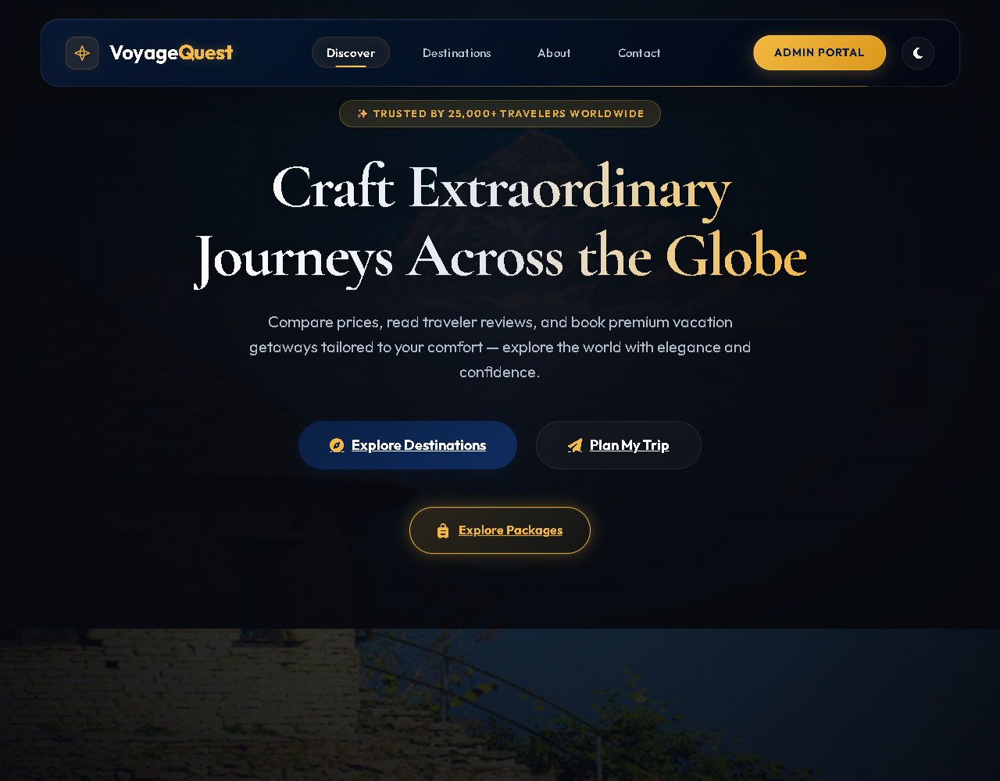
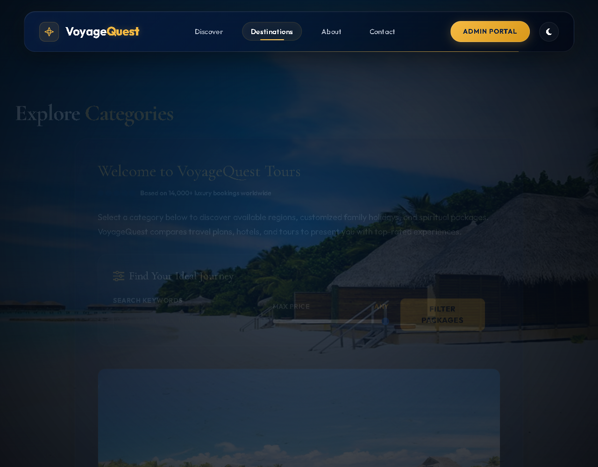
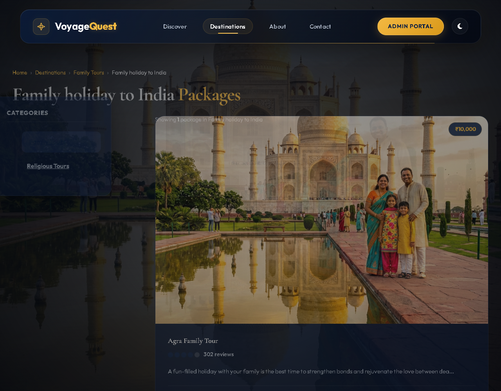
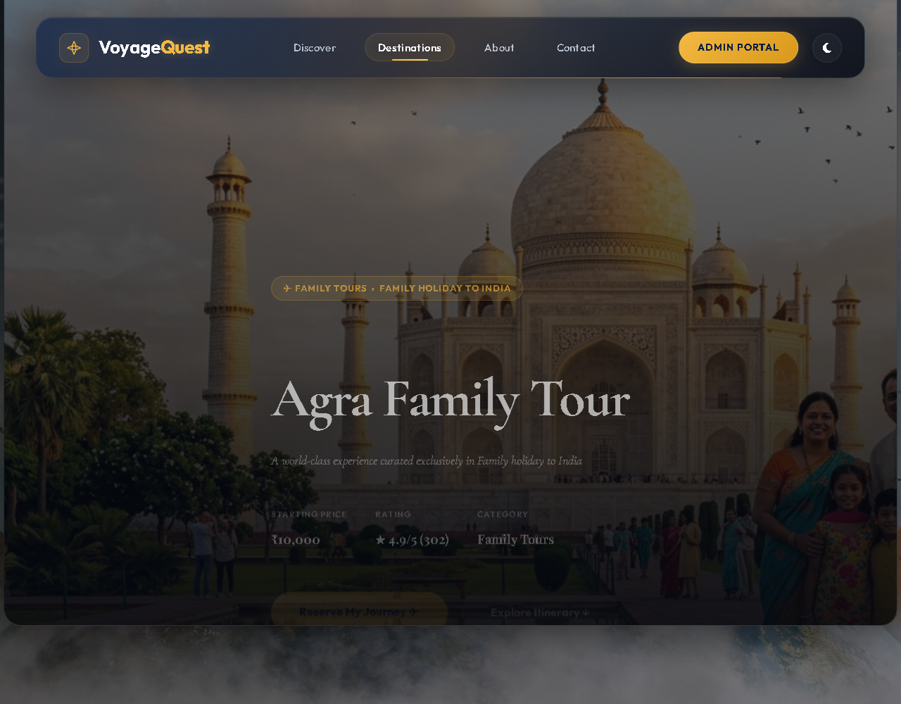
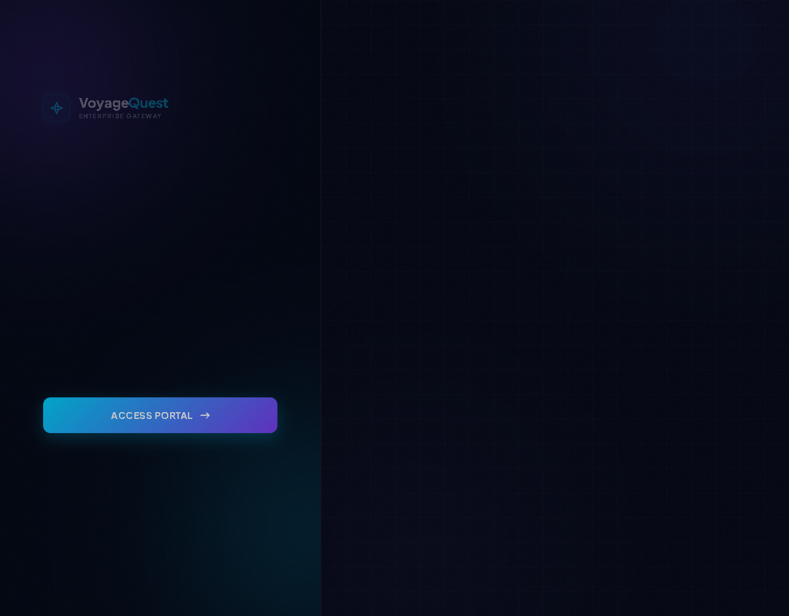

# VoyageQuest | Travel & Tourism Management System

VoyageQuest is a high-end, premium Travel & Tourism Management System designed to offer users an elegant, luxury experience when exploring destinations and booking packages. It includes a complete frontend for clients to browse destinations, view package details, and make bookings, combined with a robust, secure back-office Admin Control Panel for managing categories, packages, users, and customer booking enquiries.

---

## 📸 Project Screenshots

### 1. Immersive Homepage
The main landing page features a luxury aesthetic, custom glassmorphism navigation, responsive Bento Grid "About Us" section, and a custom airplane SVG flight path animation.


### 2. Category & Destinations Explorer
Provides clean filtering and exploration of available tour categories such as Family Tours, Religious Tours, and Adventure getaways.


### 3. Travel Packages Listing
Displays comprehensive details, price points, and premium thumbnails of curated packages matching a selected subcategory.


### 4. Package Detail View
Offers an interactive interface showing detailed package plans, high-resolution photo galleries, and an entry-point to request information.


### 5. Secure Admin Login Portal
A protected gate for administrators to access back-office dashboard panels.


---

## 🌟 Features

### Client Portal (Frontend)
- **Luxury Aesthetic Design**: Rich visual branding featuring dark gradients, gold typography, customized SVG animations (airplane flight routing), and responsive navigation.
- **Dynamic Tour Browsing**: Browse packages organized by **Categories** (e.g., Family Tours, Religious Tours) and **Subcategories** (e.g., Family holiday to India, Canada wilderness).
- **Comprehensive Package Details**: View customized plans, multiple high-res slideshows, descriptions, and transparent pricing.
- **Booking Enquiry System**: Interactive submission form where customers can request information, specify the number of days, adults/children count, and add special requests.
- **Contact Us & Newsletter Form**: Multi-channel interactions for client feedback and email signups.

### Security Enhancements
- **SQL Injection Prevention**: Built-in wrapper `prepare_query` and `prepare_exec` enforcing MySQLi prepared statements across database operations.
- **Cross-Site Scripting (XSS) Protection**: Clean output encoding using HTML character entity translation (`h()` function wrapper).
- **CSRF Token Validation**: Built-in state verification using session tokens to validate forms submitted to database controllers.

### Admin Control Dashboard (Backend)
- **Real-Time Analytics & Statistics**: Fast overview of active users, package catalogs, categories, and pending enquiries.
- **Package Management (CRUD)**: Create, view, update, and delete packages, upload high-res imagery, and define prices.
- **Category & Subcategory Management (CRUD)**: Organize tour categories and link subcategory profiles cleanly.
- **User Account Management (CRUD)**: Control database system users, create admins, or generic staff entries.
- **Interactive Booking Enquiries Handler**: Read customer requests, evaluate contact info, and update status from **Pending** to **Confirmed** or **Cancelled**.

---

## 🛠️ Technology Stack

- **Frontend**: HTML5, CSS3 (Luxury Modern Design Theme, Bento Layouts, Glassmorphic Headers), JavaScript, Bootstrap 5, SVG Path Animations
- **Backend**: PHP (Modular structure, Prepared Statements, Secure Sessions)
- **Database**: MySQL (Relational tables, InnoDB engine)
- **Environment**: Apache Web Server (XAMPP ecosystem compatibility)

---

## 📂 Project Directory Structure

```text
travel/
│
├── Admin/                    # Admin Control Panel Directory
│   ├── addcategory.php       # Add a new tour category
│   ├── addpackage.php        # Create a new travel package
│   ├── addsubcategory.php    # Add a new subcategory
│   ├── adduser.php           # Register a new back-office user
│   ├── chstatus.php          # Update booking request status
│   ├── deletecategory.php    # Remove categories
│   ├── deletepackage.php     # Remove packages
│   ├── deletesubcategory.php # Remove subcategories
│   ├── deleteuser.php        # Remove users
│   ├── index.php             # Admin Dashboard landing page
│   ├── left.php              # Sidebar navigation component
│   ├── loginform.php         # Secure Admin login page
│   ├── logout.php            # Destroys session and logs out
│   ├── stats.php             # System stats & counter metrics
│   ├── style.css             # Styling rules for Admin Panel
│   ├── top.php               # Dashboard navbar header
│   └── update*.php           # Category, Subcategory, Package, and User update forms
│
├── css/                      # Stylesheets Directory
│   ├── luxury_travel.css     # Main luxury custom branding styles
│   ├── modern.css            # Legacy overrides
│   └── owl.carousel.css      # Testimonial slider styles
│
├── database/                 # Database dumps
│   └── travel.sql            # Master database schema script
│
├── images/                   # Asset Repository
│   ├── projectpics/          # Client-facing package images
│   ├── screenshots/          # Documentation screenshots
│   └── travelimage.jpg       # Immersive Hero Banner asset
│
├── js/                       # Client Scripts Directory
│   └── bootstrap.bundle.js   # Bootstrap library script
│
├── config.php                # Database Connection configurations
├── function.php              # Shared core functions (Prepared queries, XSS sanitization, CSRF protection)
├── index.php                 # App homepage (VoyageQuest landing)
├── aboutus.php               # Info page
├── category.php              # Tour Category explorer
├── subcat.php                # Subcategory viewer
├── package.php               # Package listing viewer
├── detail.php                # Detailed Package page
├── enquiry.php               # Customer booking enquiry submission form
├── start_local_server.bat    # Automated environment launcher script
├── stop_local_server.bat     # Automated server stopper script
└── travel.sql                # Relational Schema backup
```

---

## 🚀 Installation & Local Setup

To deploy the VoyageQuest local environment on your machine:

### Prerequisites
1. Install **XAMPP** (includes Apache and MySQL/MariaDB). Download from [Apache Friends](https://www.apachefriends.org/).

### Steps

1. **Clone/Copy Project**:
   Copy or clone this repository directory into your XAMPP server's root folder (usually `C:\xampp\htdocs\`). Ensure the folder name is `travel`.
   ```bash
   C:\xampp\htdocs\travel
   ```

2. **Start Services & Import Database**:
   - Open your XAMPP Control Panel and start **Apache** and **MySQL**.
   - Open your browser and go to `http://localhost/phpmyadmin/`.
   - Create a new database named **`travel`**.
   - Click the **Import** tab, select the `travel.sql` file (found in the root or `database/` folder), and click **Go** to import tables.

3. **Configure Settings**:
   If your MySQL has a password or a different host, edit the `config.php` file in the root folder:
   ```php
   define('DB_HOST', 'localhost');
   define('DB_USER', 'root');
   define('DB_PASS', ''); // Add password if necessary
   define('DB_NAME', 'travel');
   ```

4. **Launch Application**:
   Double click the `start_local_server.bat` file in your root folder, or navigate directly to:
   ```text
   http://localhost/travel/index.php
   ```

---

## 🔑 Administrative Access

To access the back-office dashboard, go to the Admin tab in the header or navigate directly to `http://localhost/travel/Admin/loginform.php`.

*   **Default Admin Username**: `admin`
*   **Default Admin Password**: `admin`

---

## 🛡️ License
Distributed under the MIT License. See `LICENSE` for more information.
